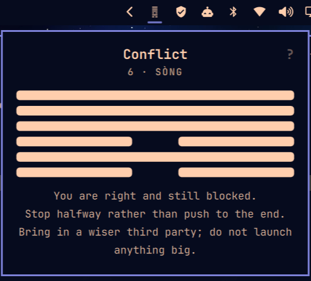
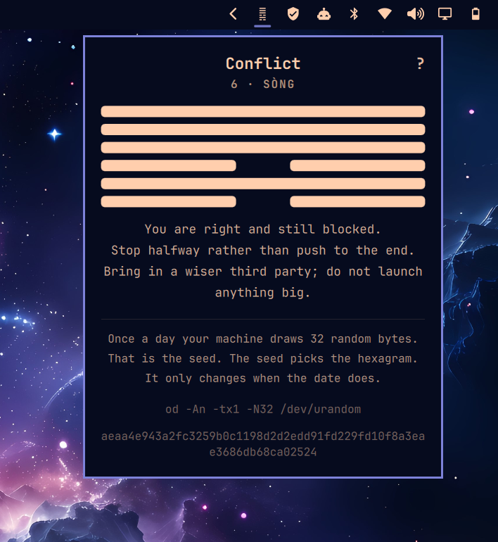

# Daily Hexagram

One I Ching hexagram sits in your Omarchy bar. It changes once a day.



Your machine throws the coins:

```
od -An -tx1 -N32 /dev/urandom | tr -d ' \n'; echo
```

32 bytes, the size of a private key, cached per calendar day in
`~/.cache/daily-hexagram/seed`. The first six bytes are the six lines. The low
three bits of each byte are three coins; an odd number of heads is yang.

One seed, one hexagram. No changing lines, no "becomes". The day gives you one
answer.

The bar shows it as its Unicode glyph (U+4DC0 to U+4DFF). Click it for the
name, the six lines and a short plain-English explainer. The `?` in the corner
folds out how it was cast, with the seed itself.



The explainers are original short paraphrases written for this plugin, MIT
like the rest. Wilhelm's English is still under copyright and Legge's 1882
prose is not what you want at 9 AM. If you want the full oracle with line
texts, see layolayo/omarchy-iching-oracle. This is not that. This is the date,
but for the I Ching.

## Install

```
omarchy plugin add https://github.com/remigius-labs/omarchy-hexagram
```

Then enable it from the bar settings, or:

```
omarchy plugin enable remi.hexagram --section right
```

## Remove

```
omarchy plugin disable remi.hexagram
omarchy plugin remove remi.hexagram
rm -rf ~/.cache/daily-hexagram
```

The plugin writes exactly one file outside its own folder: the day's seed in
`~/.cache/daily-hexagram/seed`. It never touches your config.

## Limits

Needs a font with the Yijing Hexagram Symbols block; Noto Sans Symbols 2 or
DejaVu cover it and Omarchy ships both. The explainers are two lines each, on
purpose. No line texts, no changing lines, no question asked.

## License

MIT.
